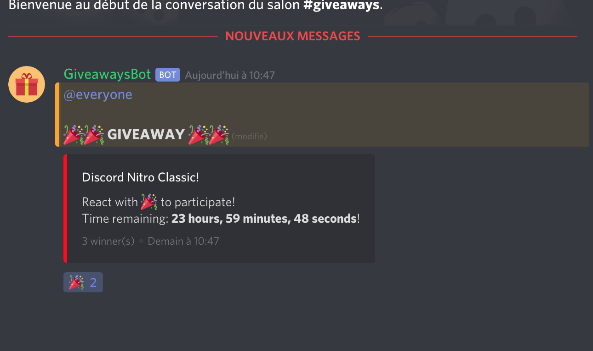

# Giveaways Bot

🎁Giveways Bot using the [discord-giveaways](https://npmjs.com/discord-giveaways) package!

## Features

* `start-giveaway` command
* `reroll-giveaway` command
* `end-giveaway` command

</img>

## Install


* Fill configuration (config.json):
```json
{
    "token": "Your discord bot token",
    "prefix": "g!",
    "everyoneMention": true,
    "hostedBy": true
}
```

* Install dependencies:
```sh
npm install
```

* Start:
```sh
node index.js
```
